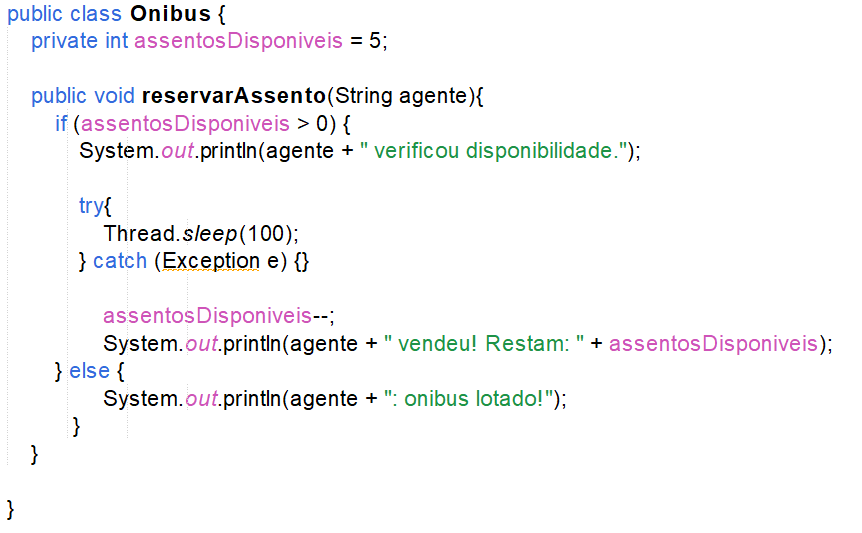
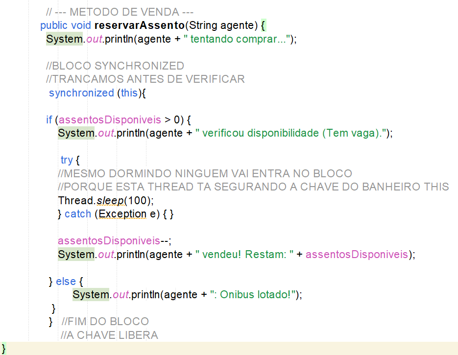
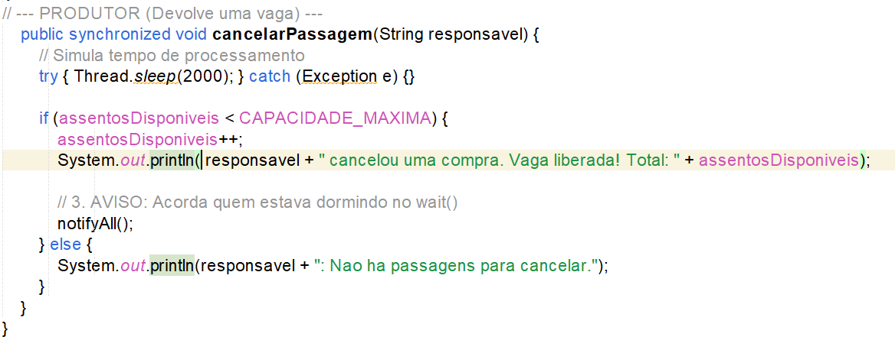
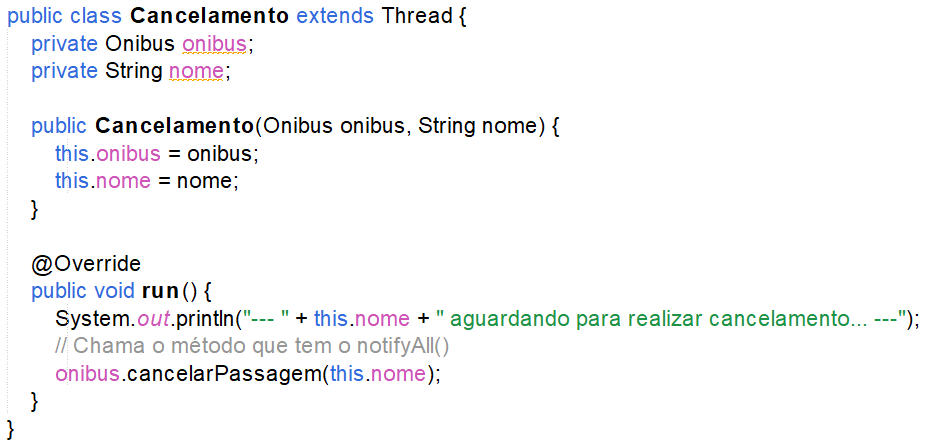
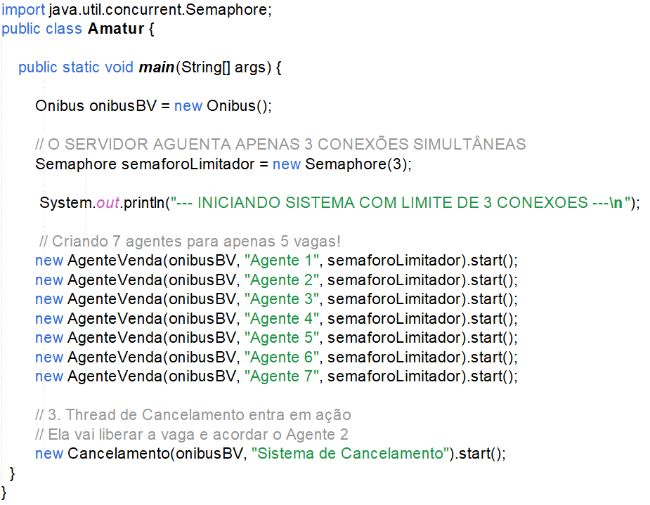
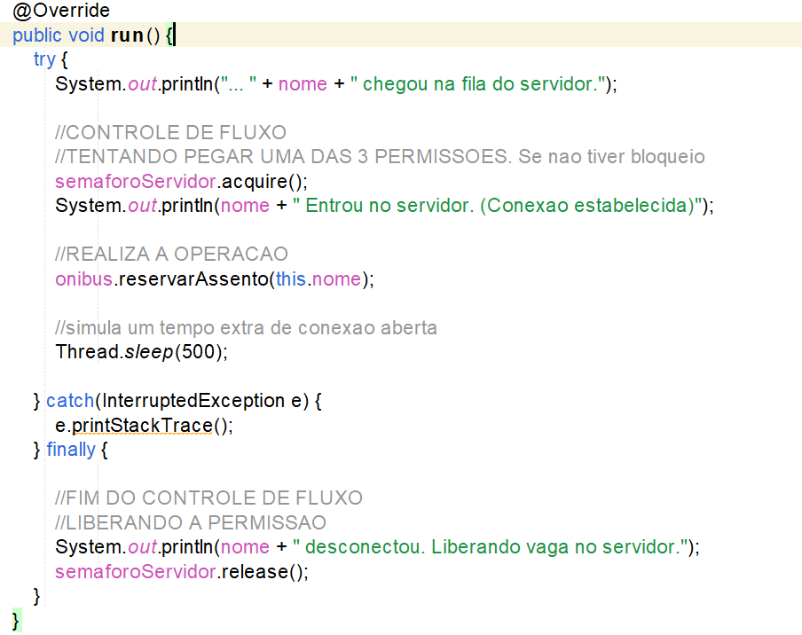

# DCC305 - PROGRAMAÇÃO ORIENTADA A OBJETOS
## Trabalho Prático: O Desafio da Concorrência na AMATUR

- **Parte I: O Caos (Race Condition)**

**Captura de Tela da saída do console no NetBeans:**

**Legenda:**  
  _O resultado acima foi montado no NetBeans e utiliza a lógica errada das Threads onde ocorre uma Condição de Corrida (Race Condition) quando a saída de um programa 
  depende da ordem ou do timing não controlados em que múltiplas threads acessam e modificam dados compartilhados._

--- 

- **Parte II: A Solução com Blocos Sincronizados (Mutex)**

No Slide 36 (Aula 21)  explica como proteger somente a seção critica, onde podemos sincronizar apenas a porção específica de código que realmente precisa de exclusão mútua, usando um objeto explícito como lock ( synchronized (this)) ...

**Captura de Tela do Algoritmo SEM as Implementações proposta:**

**Legenda:** 
_O perigo está entre o if e o assentosDisponiveis-- - a seção crítica desprotegida!_

**A solução: Synchronized**

Para usar um bloco sincronizado explícito protegendo apenas o necessário, deve envolver a verificação e a ação. O objeto de lock mais comum é o próprio this (a instância do ônibus) ou um objeto criado apenas para ser cadeado.

**Captura de Tela do Algoritmo COM as Implementações corretas no Bloco:**

**Legenda:** 
_Isso melhora a performance pois não prende as outras threads. O synchronized resolve a inconsistência garantindo duas coisas:_

- _Exclusão Mútua: Apenas uma thread escreve na variável por vez._

- _Visibilidade de Memória: Quando o Agente X solta a chave, o Java garante que a alteração que ele fez na memória RAM (de 1 para 0) seja imediatamente visível para o Agente Y. Sem isso, o Agente Y poderia ler um valor "velho" do cache da CPU._

---

- **Parte III: O "Desafio de Casa" (Wait e Notify)**

Comunicação entre Threads: No slide 19 da aula 22 fala sobre wait e notify. As vezes, não basta sincronizar - as threads precisam conversar e coordenar suas ações. É o padrão Produtor_Consumidor.
- Para que o wait() e o notify() funcionem, eles devem ser chamados dentro dos métodos do Objeto Compartilhado (no caso, a classe Onibus)

**Captura de Tela do Algoritmo com Wait e notifyall:**

**Legenda:** 
_O método de venda espera (wait) se estiver lotado, e o método de cancelamento avisa (notifyAll) quando libera vaga_

**Legenda:**
_Classe Cancelamento (Produtor)_
_Essa classe espera um pouco e depois libera uma vaga, chamando o notify indiretamente através do método do ônibus._

---

- **Parte IV: Controle de Fluxo com Semáforos**

No Slide 22 (Aula 22) da inicio ao assunto semáforos, ele funciona como um controlador inteligente de acesso, gerenciando um contador de vagas disponíveis.

Enquanto o synchronized controla a integridade dos dados (quem senta na cadeira), o Semaphore controla o fluxo de entrada (quem entra na sala).

Para implementar esse "Segurança da Balada" que limita o servidor a 3 conexões simultâneas, precisamos modificar a classe do Agente para que ele respeite o semáforo antes de tentar falar com o ônibus.

Neste código:

1. Criamos um Semaphore(3) na main.

**Legenda:**
_Passamos esse semáforo para todos os Agentes._

1. No run() do AgenteVenda, usamos acquire() (entrar na balada) e release() (sair da balada).

**Legenda:**
acquire(): Pega uma ficha.

- Se contador > 0: Diminui 1 e passa.

- Se contador == 0: A Thread dorme e espera alguém devolver uma ficha.

release(): Devolve a ficha. Aumenta o contador e acorda a próxima thread da fila.

## O que você verá na execução:

1. Entrada Imediata: Os Agentes 1, 2 e 3 mostrarão a mensagem  `ENTROU no servidor` quase ao mesmo tempo.

1. Bloqueio: Os Agentes 4, 5 e 6 mostrarão `... chegou na fila`, mas ficarão travados. Eles não conseguem entrar porque o semáforo está zerado (3 permissões usadas).

1. Liberação: Assim que o Agente 1 terminar e chamar release() (🔴 desconectou), o Agente 4 (ou outro da fila) imediatamente ganhará a permissão e entrará.

**Resumo dos Métodos do Semaphore**
new Semaphore(3): Inicializa o contador com 3 fichas.

acquire(): Pega uma ficha.

Se contador > 0: Diminui 1 e passa.

Se contador == 0: A Thread dorme e espera alguém devolver uma ficha.

release(): Devolve a ficha. Aumenta o contador e acorda a próxima thread da fila.

## Conclusão:

Concluímos nesta tarefa uma série de práticas essenciais da programação concorrente em Java. Aprendemos a identificar os perigos da concorrência e a aplicar mecanismos de sincronização, coordenação entre threads e gerenciamento de capacidade para criar sistemas mais seguros e eficientes.

---

Relatório elaborado por: **Alonso Fernandes Cavalcante**  
Última atualização: **12/12/2025**

